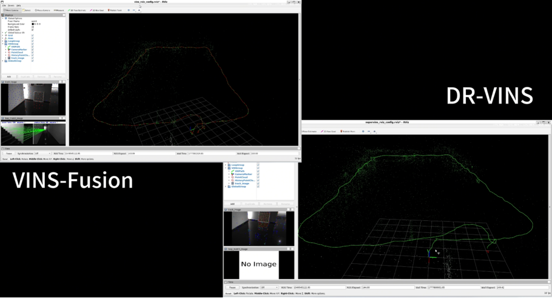
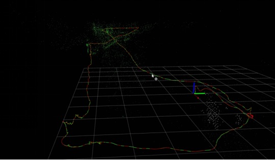
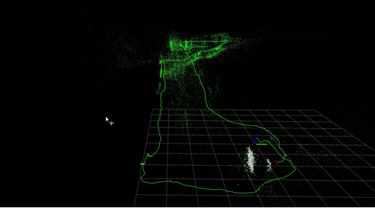
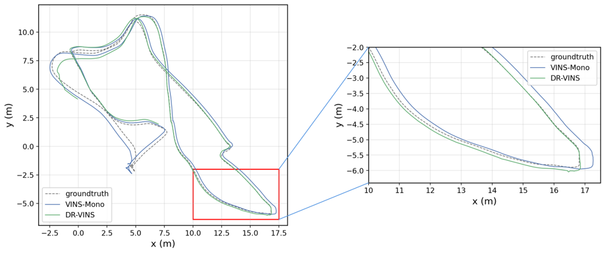
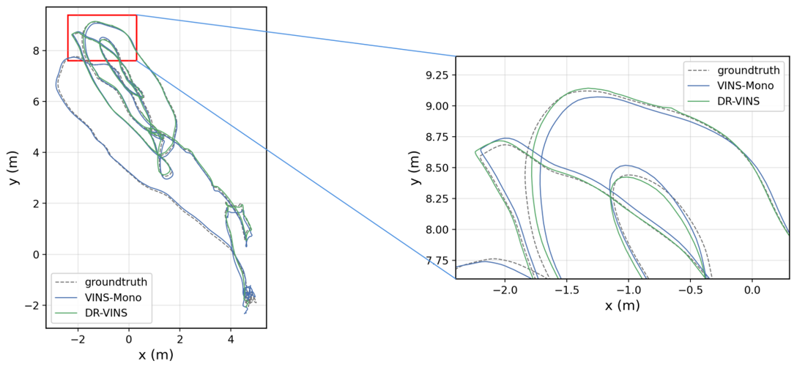

# DR-VINS: Robust Visual-Inertial SLAM for Degraded Scenes

DR-VINS is a visual-inertial SLAM experimental system designed for degraded visual environments such as low-texture scenes, illumination changes, over-exposure, and indoor-outdoor transitions. The project is based on the VINS-style visual-inertial estimation framework and introduces a deep feature matching frontend to improve localization robustness in challenging scenarios.

本项目为本科毕业设计实验系统，主要面向低纹理、光照变化、强光过曝和室内外切换等退化场景下的视觉惯性定位与建图问题。

---

## Table of Contents

- [1. Project Overview](#1-project-overview)
- [2. Main Features](#2-main-features)
- [3. Repository Structure](#3-repository-structure)
- [4. Environment](#4-environment)
- [5. Dataset Preparation](#5-dataset-preparation)
- [6. Running Examples](#6-running-examples)
- [7. Evaluation](#7-evaluation)
- [8. Representative Results](#8-representative-results)
- [9. Demo Videos](#9-demo-videos)
- [10. Runtime Notes](#10-runtime-notes)
- [11. Notes and Known Issues](#11-notes-and-known-issues)
- [12. Acknowledgements](#12-acknowledgements)
- [13. License](#13-license)

---

## 1. Project Overview

Traditional visual-inertial SLAM methods may suffer from tracking instability or trajectory drift when visual features become sparse or unreliable. DR-VINS integrates a deep feature extraction and matching frontend with a VINS-style backend and loop fusion module, aiming to improve robustness under degraded visual conditions.

The project includes:

- Modified SuperVINS / DR-VINS source code
- EuRoC and UMA-VI configuration files
- Evaluation and plotting scripts
- Representative trajectory comparison results
- Runtime analysis scripts
- RViz screenshots and demo videos

---

## 2. Main Features

- Visual-inertial odometry based on a VINS-style sliding window backend
- Deep feature frontend using learned feature extraction and matching
- Loop fusion and pose graph optimization
- Support for EuRoC MAV dataset experiments
- Support for UMA-VI degraded-scene dataset experiments
- ATE evaluation using evo
- Trajectory visualization and local zoom-in plotting scripts
- Preliminary runtime analysis for frontend feature extraction and matching

---

## 3. Repository Structure

```text
DR-VINS/
├── src/
│   └── SuperVINS/                  # Main DR-VINS / SuperVINS source code
├── configs/
│   ├── euroc/                      # EuRoC-related configuration files
│   └── umavi/                      # UMA-VI-related configuration files
├── scripts/
│   ├── plotting/                   # Trajectory plotting scripts
│   ├── evaluation/                 # Runtime and ATE-related scripts
│   └── dataset_tools/              # Dataset conversion tools
├── results/
│   └── trajectory_figures/         # Representative trajectory figures
├── media/
│   ├── screenshots/                # RViz screenshots
│   └── demo_links.md               # Demo video links
├── docs/
│   ├── environment.md              # Environment setup
│   ├── dataset_preparation.md      # Dataset preparation
│   ├── run_euroc.md                # EuRoC running instructions
│   ├── run_umavi.md                # UMA-VI running instructions
│   ├── evaluation.md               # Evaluation instructions
│   └── known_issues.md             # Notes and known issues
└── README.md
```

---

## 4. Environment

The experiments were conducted under the following environment:

- Ubuntu 20.04 under WSL2
- ROS Noetic
- CMake / Catkin
- OpenCV
- Ceres Solver
- Eigen
- PyTorch / ONNX runtime dependencies for the deep frontend
- evo for trajectory evaluation

A typical workspace structure is:

```bash
~/catkin_ws/src/SuperVINS
~/ws_vinsfusion/src/VINS-Fusion
~/datasets
~/results
```

Please refer to [`docs/environment.md`](docs/environment.md) for detailed setup instructions.

---

## 5. Dataset Preparation

This project uses EuRoC MAV and UMA-VI datasets. The datasets are not included in this repository due to their large file size.

### EuRoC MAV Dataset

Representative sequences include:

- `MH_01_easy`
- `MH_05_difficult`
- `V1_03_difficult`
- `V2_02_medium`
- `V2_03_difficult`

Example directory structure:

```bash
~/datasets/vicon_room2/V2_03_difficult/V2_03_difficult.bag
```

### UMA-VI Dataset

Representative degraded sequences include:

- `corridor-eng_LowText`
- `parking-csc1_LowText`
- `conference-csc2_IllChange`
- `third-floor-csc1_IllChange`
- `two-floors-csc1_InOut`
- `fantasy-csc1_SunOver`
- `parking-eng1_SunOver`
- `lab-module-csc_InOut`

Example directory structure:

```bash
~/datasets/UMA-VI/corridor-eng_LowText/corridor_cam2_imu0.bag
```

---

## 6. Running Examples

### 6.1 Run DR-VINS on a UMA-VI Sequence

Example: `corridor-eng_LowText`.

Terminal 1: start `roscore`.

```bash
source /opt/ros/noetic/setup.bash
source ~/catkin_ws/devel/setup.bash

roscore
```

Terminal 2: start the DR-VINS frontend.

```bash
source /opt/ros/noetic/setup.bash
source ~/catkin_ws/devel/setup.bash

rosparam set use_sim_time true

rosrun supervins supervins_node \
  ~/catkin_ws/src/SuperVINS/config/euroc/umavi_corridor_hybrid_frontend.yaml
```

Terminal 3: start the loop fusion module.

```bash
source /opt/ros/noetic/setup.bash
source ~/catkin_ws/devel/setup.bash

rosparam set use_sim_time true

rosrun hybrid_loop_fusion hybrid_loop_fusion_node \
  ~/catkin_ws/src/SuperVINS/config/euroc/umavi_corridor_hybrid_loop.yaml
```

Terminal 4: open RViz.

```bash
source /opt/ros/noetic/setup.bash
source ~/catkin_ws/devel/setup.bash

rviz -d ~/catkin_ws/src/SuperVINS/config/supervins_rviz_config.rviz
```

Terminal 5: play the dataset.

```bash
source /opt/ros/noetic/setup.bash
source ~/catkin_ws/devel/setup.bash

rosbag play --clock --pause -r 1.0 \
  ~/datasets/UMA-VI/corridor-eng_LowText/corridor_cam2_imu0.bag
```

---

## 7. Evaluation

Absolute Trajectory Error is evaluated using `evo_ape`.

```bash
evo_ape tum \
  gt.tum \
  estimated.tum \
  -va --align --t_max_diff 0.05
```

Trajectory visualization can be performed using `evo_traj`.

```bash
evo_traj tum \
  VINS-Fusion.tum \
  DR-VINS.tum \
  --ref gt.tum \
  --align \
  --t_max_diff 0.05 \
  --plot \
  --plot_mode xy
```

For local zoom-in trajectory figures, use:

```bash
python3 scripts/plotting/plot_traj_with_inset.py \
  --gt gt.tum \
  --vins VINS-Fusion.tum \
  --dr DR-VINS.tum \
  --out output.png \
  --title "" \
  --max_diff 0.05 \
  --zoom_xlim xmin xmax \
  --zoom_ylim ymin ymax
```

---

## 8. Representative Results

This section presents representative qualitative and quantitative results of DR-VINS on EuRoC and UMA-VI datasets.

### 8.1 RViz Running Screenshots

The following screenshots show RViz visualization results, including trajectory output, point cloud visualization, feature tracking images, and loop-related results.

#### VINS-Fusion vs DR-VINS RViz Comparison



#### VINS-Fusion Failure Case



#### DR-VINS Stable Running Case



These RViz screenshots provide an intuitive comparison between the baseline method and DR-VINS in challenging sequences. The baseline method may suffer from severe drift or failure, while DR-VINS can maintain better trajectory continuity in degraded visual scenes.

### 8.2 Trajectory Comparison

Representative trajectory comparison results are shown below. Local zoom-in views are included to better illustrate the difference between the estimated trajectories and the ground truth.

#### EuRoC MH05



#### EuRoC V1_03



### 8.3 Quantitative Results

Representative ATE RMSE results are summarized below.

| Dataset | Sequence | VINS-Fusion | VINS-Fusion Loop | DR-VINS | DR-VINS Loop |
|---|---|---:|---:|---:|---:|
| EuRoC | V2_02_medium | 0.144 | 0.106 | 0.092 | 0.059 |
| EuRoC | V2_03_difficult | 0.205 | 0.097 | 0.191 | 0.139 |
| UMA-VI | corridor-eng_LowText | 0.409 | 0.382 | 0.690 | 0.059 |
| UMA-VI | conference-csc2_IllChange | 0.798 | 0.803 | 0.038 | 0.019 |
| UMA-VI | third-floor-csc1_IllChange | failed | failed | 0.063 | 0.042 |
| UMA-VI | two-floors-csc1_InOut | failed | failed | 1.513 | 0.088 |

More trajectory figures are provided in [`results/trajectory_figures`](results/trajectory_figures).---

## 9. Demo Videos

Representative RViz running videos are provided through GitHub Releases.

- [DR-VINS Demo Videos Release](https://github.com/jzk0406/DR-VINS/releases/tag/v1.0-demo)
- [Demo video list](media/demo_links.md)

The videos include RViz visualization results of EuRoC and UMA-VI sequences, including trajectory output, feature tracking images, point cloud visualization, and loop-related results.

---

## 10. Runtime Notes

A preliminary runtime analysis was conducted on the EuRoC `MH_01_easy` sequence. The observed frontend statistics were:

| Metric | Result |
|---|---:|
| Average feature extraction time | 0.013860 s |
| Feature extraction FPS | 72.148 FPS |
| Average feature matching time | 0.028893 s |
| Feature matching FPS | 34.610 FPS |
| Average number of feature points | 1107.411 |
| Average number of matches | 687.287 |
| Pose output frequency | approximately 10 Hz |

These results indicate that the frontend has quasi-real-time processing capability under the tested environment. However, strict real-time performance across different hardware platforms and all dataset sequences requires further systematic evaluation.

---

## 11. Notes and Known Issues

- The system was mainly evaluated using offline rosbag playback.
- Some sequences are sensitive to initialization, ROS node states, output paths, and runtime load.
- For stable experiments, it is recommended to:
  - restart `roscore` before each run;
  - clean old ROS nodes;
  - use independent absolute output paths;
  - avoid mixing old pose graph outputs;
  - run numerical evaluation separately from heavy RViz recording.
- RViz loop visualization and loop optimization output are not always equivalent. Loop effectiveness should be judged using trajectory files and ATE results.

---

## 12. Acknowledgements

This project is based on and inspired by the following open-source projects:

- VINS-Fusion
- SuperVINS
- evo trajectory evaluation toolbox

The baseline VINS-Fusion system is used for comparative experiments. Please refer to the original repositories for their official implementations and licenses.

---

## 13. License

This repository is released for academic and research purposes. Please check the licenses of the upstream projects before redistribution or commercial use.